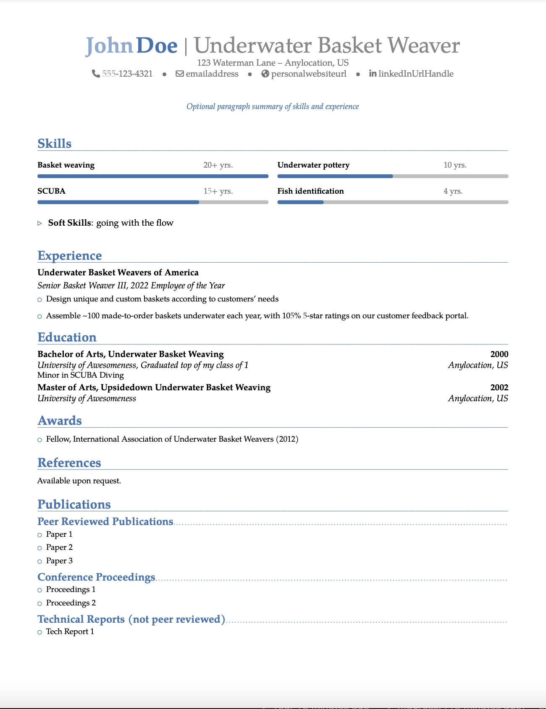
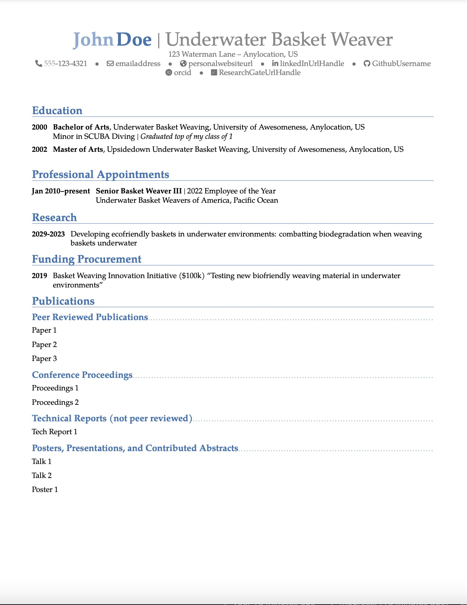
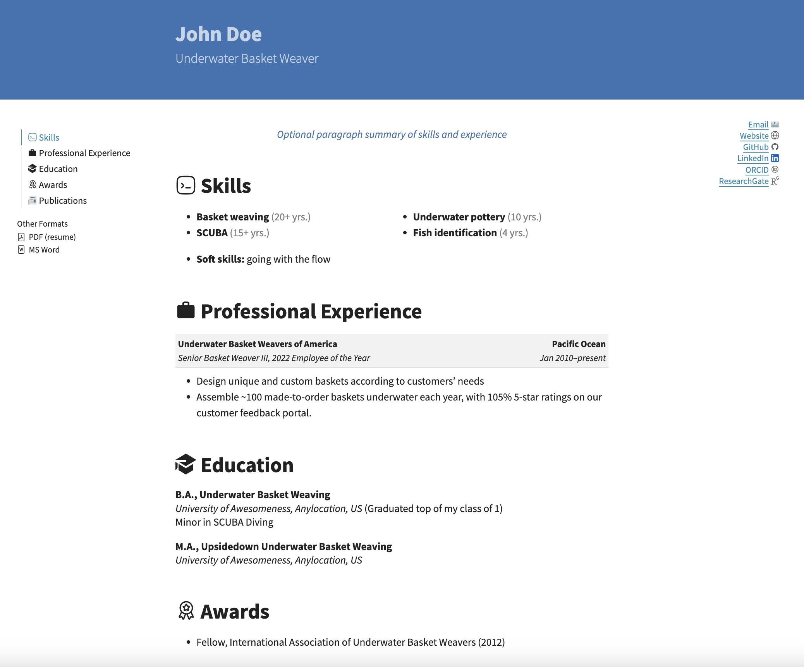

# resume-quarto-moderncv

## Professional r&#232;sum&#232; and academic curriculum vit&aelig; easily generated in `pdf`, `html`, and `docx` formats

### Overview
This template can be used to easily create a professional private sector r&#232;sum&#232; and/or an academic curriculum vit&aelig; (CV) in `pdf`, `html`, and `docx` formats using [Quarto](https://quarto.org/) and [Python](https://www.python.org/):

* [Quarto](https://quarto.org/docs/get-started/) (>= 1.6.42)
* [Python](https://www.python.org/downloads/) (>= 3.9.6)

The `pdf` version is a custom and limited Quarto implementation of the LaTeX [moderncv](https://ctan.org/pkg/moderncv) template. The implementation is inspired by and derived from the [modern2-cv](https://github.com/schochastics/modern2-cv) Quarto template by [schochastics](https://github.com/schochastics).

The `html` rendering supports integration with a portfolio website. It is based upon [this quarto-resume](https://github.com/busemorose/resume_quarto) by user [busemorose](https://github.com/busemorose), but uses Python instead of R to format the content, mostly due to seemingly endless challenges installing R's flextable package.

Credit and kudos to both authors, as well as all upstream template authors, none of whom I know personally. Thank you for your contributions to [open science](https://en.wikipedia.org/wiki/Open_science). This template serves to pay it forward.

The `docx` version is intended to provide a quick and easy way to populate a Microsoft Word document with the same content for occasions when this file format is needed. While the `pdf` and `html` versions are properly and similarly formatted, the `docx` version requires considerable manual intervention after the file is created.

R&egrave;sum&egrave; and CV content are entered in `_contents.yml`. File customizations can be made in `resume.qmd` and `cv.qmd`. Instructions are provided below.

### Preview

::: {#resume-pdf layout-ncol=2 layout-nrow=2}








:::

### Creating a R&egrave;sum&egrave; and CV

R&egrave;sum&egrave; and CV content are provided in YAML format in `_content.yml`. Most of the variables are used in both the r&egrave;sum&egrave; and CV, streamlining the process of making two separate but related documents. However, some entries are unique to one or the other document. All are described below. All entries are strings unless otherwise noted.

#### Header Information

Header information appears in the banner at the top of the `html` rendering. These include the standard Quarto `title` and `subtitle` top-level YAML arguments:

| Keyword       | Description                                   |
| :------------ | :-------------------------------------------- |
| `title`       | Your full name  for website header            |
| `subtitle`    | Occupation or job title                       |
: `_content.yml`

For example:

```{.yaml filename="_contents.yml"}
---
title: "John Doe"
subtitle: "Underwater Basket Weaver"
---
```

The name displayed at the top of the `pdf` and `docx` files are passed to `author` via second-level `firstname` and `lastname` arguments:

| Keyword       | Description                                   |
| :------------ | :-------------------------------------------- |
| `firstname`   | Your first name for `pdf` and `docx` files    |
| `lastname`    | Your last name for `pdf` and `docx` files     |
: `_content.yml`

```yaml
author:
  firstname: "John"
  lastname: "Doe"
```

Note that your name needs to be provided *twice* in `_contents.yml`: to `title` and to `author`, in order for all documents to display properly.

#### Contact Information

Contact information for the top of the r&egrave;sum&egrave; and CV are passed to the top level `content` key, as in `author` above:

| Keyword       | Description                                   |
| :------------ | :-------------------------------------------- |
| `phone`       | Phone number                                  |
| `email`       | Email address. Will generate a "mailto" call if formatted properly as an email address (with an "@" symbol)             |
| `website`     | URL to personal or professional website       |
| `github`      | Your [GitHub](https://github.com) username only. Will generate the custom web URL directing to this user's dashboard. |
| `linkedin`    | Your [LinkedIn](https://www.linkedin.com/) handle only. Will generate the custom web URL directing to this user's public page. |
| `orcid`       | Your [ORCID](https://orcid.org/) number only.  Will generate the custom web URL directing to this user's public page.|
| `researchgate` | Your [ResearchGate](https://www.researchgate.net/) handle only.  Will generate the custom web URL directing to this user's public page. |
| `extrainfo`   | Any other information to include at the top of the r&egrave;sum&egrave; and CV? |
: Contact info options for r&egrave;sum&egrave;s and CVs. Omitted if empty or not passed.

A physical or mailing address can also be passed to the `contact` key. It is separated into `line1` and `line2` keys:

```yaml
contact:
  address:
    line1: "123 Waterman Lane"
    line2: "Anylocation, US"
```

Putting it all together so far:

```{.yaml filename="_contents.yml"}
---
title: "John Doe"
subtitle: "Underwater Basket Weaver"
author:
  firstname: "John"
  lastname: "Doe"
contact:
  address: 
    line1: "123 Waterman Lane"
    line2: "Anylocation, US"
  phone: "555-123-4321"
  email: "emailaddress"
  website: "personalwebsiteurl"
  github: "GithubUsername"
  linkedin: "linkedInUrlHandle"
  orcid: "orcid"
  researchgate: "ResearchGateUrlHandle"
  extrainfo: "Anything else to highlight up front?"
---
```

#### Summary

An optional professional summary for the r&egrave;sum&egrave; can be passed to the top level `summary` key, if desired. This is usually a paragraph-like executive summary of the r&egrave;sum&egrave; itself or used to highlight or emphasize key knowledge, skills, and abilities. Omit if not desired.

The summary does not appear in the CV.

#### Education

Education (*i.e.*, degrees earned) is provided as a list of `items` with the following elements:

| Keyword       | Description                                   |
| :------------ | :-------------------------------------------- |
| `degree`      | Type of degree (*e.g.*, B.S., Master's of Science, *etc.*) |
| `major`       | Primary field or area of study of the degree  |
| `institution` | Name of the degree-granting institution       |
| `location`    | Location of the institution                   |
| `date`        | Date of degree conferral                      |
| `minor`       | Minor or secondary area(s) of study (optional) |
| `extra`       | Any additional information related (*e.g.*, awards) (optional) |

For example:

```yaml
education:
  items:
    - degree: "Bachelor of Arts"
      major: "Underwater Basket Weaving"
      institution: "University of Awesomeness"
      location: "Anylocation, US"
      date: "2000"
      minor: "SCUBA Diving"
      extra: "Graduated top of my class of 1"
```

#### Skills

Technical skills are included in r&egrave;sum&egrave;s only. They are displayed as a simple bulleted list for `html` and `docx` and as a table with status bar-like visualizations of overall competence in `pdf` rendering. They are provided as a list of `items`, as in `education` above, with the following entries:

| Keyword       | Description                                   |
| :------------ | :-------------------------------------------- |
| `skill`       | Name of the skill                             |
| `years`       | Number of years of experience                 |
| `scale`       | Float, value between 0 and 1 quantifying the level of experience. Should be relative to `years`. For example, the skill with the maximum number of years of experience should have `scale` = 1. |

The `skills` section also takes two additional arguments:

| Keyword       | Description                                   |
| :------------ | :-------------------------------------------- |
| `ncol`        | Integer specifying the number of columns for the skills list |
| `softskills`  | Additional soft (*i.e.*, non-technical) skills passed as a stingle string of comma-separated skills (optional) |

#### Experience

Professional experience is passed as a list of `items`, as in `education` above, with the following entries:

| Keyword       | Description                                   |
| :------------ | :-------------------------------------------- |
| `role`        | Job or position title                         |
| `employer`    | Name of employer                              |
| `location`    | Location of employer                          |
| `date`        | Date(s) of employment                         |
| `details`     | Description of job duties or accomplishments. This must be a single string, but asterisks (*) will be treated as bullets and will create a list when rendered. See example below. |
| `extra`       | Any additional information to include (optional) |

For example:

```yaml
experience:
  items:
    - role: Senior Basket Weaver III
      employer: Underwater Basket Weavers of America
      location: Pacific Ocean
      extra: 2022 Employee of the Year
      date: Jan 2010--present
      details: |
        * Design unique and custom baskets according to customers' needs
        * Assemble ~100 made-to-order baskets underwater each year, with 105% 5-star ratings on our customer feedback portal.
```

#### Research

The optional research category is only used in CVs. Research activities are passed as a list of `items`, as in `education` above, with the following keywords:

| Keyword       | Description                                   |
| :------------ | :-------------------------------------------- |
| `entry`       | Description of research activity              |
| `date`        | Date(s) of research activity                  |

For example:

```yaml
research:
  items:
    - entry: "Developing ecofriendly baskets in underwater environments: combatting biodegradation when weaving baskets underwater"
      date: 2029-2023
```

#### Awards

The optional `awards` category is only used in r&egrave;sum&egrave;s. Provide a list of `items` with keyword `award`.

#### Funding Awards

The optional `fundingawarded` category is used only CVs to list grants or other competitive funding. Provide as a list of `items` with keywords `entry` and `date`, as in `research` above.

#### Publications

Four categories of `publications` are supported: `peer-reviewed` for peer-reviewed publications such as journal articles; `proceedings` for conference proceedings; `tech-reports` for non-peer reviewed technical reports; and `talks` for presentations, posters, or contributed abstracts. All categories are passed as lists of `items` with keyword `paper`. For example:

```yaml
publications:
  peer-reviewed:
    items:
      - paper: Paper 1
      - paper: Paper 2
      - paper: Paper 3
```

#### Miscellaneous

The r&egrave;sum&egrave; and CV file names are passed to `resumefilename` and `cvfilename`, respectively (do not include a file extension.) These are used to create hyperlinks to the `pdf` and `docx` files.

### Customization

#### Rendering `html` and `docx`

R&egrave;sum&egrave; and CV renderings can be customized in `resume.qmd` and `cv.qmd` Quarto markdown files, respectively. The most important elements to modify are the `output-file` arguments in the front matter under `resume-pdf` and `docx` in `resume.qmd` to specify the name of the r&egrave;sum&egrave; file the produced, and under `cv-pdf` and `docx` in `cv.qmd` to specify the name of the CV file to be produced.

The body of these markdown files controls the `html` and `docx` renderings. One may wish to  add, remove, or rearrange sections to either document, or change header names. In addition, any social or web media omitted from the `contact` section in `_contents.yml` should be removed or commented out in these files to prevent errors during rendering if `html` and/or `docx` renderings are desired. The current version of this template does not handle these entries conditionally.

These renderings are constructed using Python functions found in `scripts/moderncv.py`. All functions process subsets of `_contents.yml` passed to an `items` keyword. (Python loads the contents of YAML files as nested dictionaries and lists.) For example, multiple entries under the `skills` category in `_contents.yml` would create a list of dictionaries, one dictionary per skill, which would look like this:

```{.python filename="Sample Python function"}
with open("_contents.yml", "r") as f:
  contents = yaml.safe_load(f)

print(contents['skills']['items'])

[{
    'skill': 'Basket weaving',
    'years': '20+ yrs.',
    'scale': 1
},
{
    'skill': 'SCUBA',
    'years': '15+ yrs.',
    'scale': 0.7 
},...]
```

Some functions take additional arguments; these are summarized here but consult the respective docstrings for more information.

| Function      | Arguments                 | Usage             |
| :------------ | :------------------------ | :-----------------|
| `mdlist`      | `items`: as described above <br> `bullets`: whether or not to include bullets in the list | Create a simple list of entries. Used for Awards and Publications. |
| `mdskills`    | `items`: as described above <br> `ncols`: number of columns the skills table should be arranged in <br> `icons`: whether skills should be prefaced by an appropriate icon, if one is available for that skill (displayed in `html` rendering only) | Display skills in a r&egrave;sum&egrave;, either as a table (`pdf`) or a bulleted list (`html` and `docx`) |
| `mdeducation` | `items`: as described above <br> `abbrev`: whether or not to always abbreviate degree type | Create a formatted list of degrees for a r&egrave;sum&egrave; |
| `mdexperience`| `items`: as described above | Create a formatted list of professional experiences for a r&egrave;sum&egrave; |
| `cventry`     | `items`: as described above | Create a list of CV entries prefaced by the date. Used for Research and Funding categories. |
| `cvexperience` | `items`: as described above | Create a list of professional experiences prefaced by the date for a CV |
| `cveducation` | `items`: as described above | Create a list of educational degrees prefaced by the date for a CV |

#### Rendering `pdf`

Customizing the `pdf` renderings is somewhat more involved, as it requires knowledge of LaTeX in addition to the Markdown described above. The `pdf` r&egrave;sum&egrave; and CV renderings are templated in `_extensions/schochastics/resume/resumetemplate.tex` and `_extensions/schochastics/cv/cvtemplate.tex`, respectively. Sections can be added, removed, or rearranged in these files, as well as other more advanced customizations, if one knows what one is doing in LaTeX. The advanced user may also find the LaTeX ["moderncv" package documentation](https://ctan.math.washington.edu/tex-archive/macros/latex/contrib/moderncv/manual/moderncv_userguide.pdf) helpful.

### Advanced

As with all Quarto projects, additional modifications can be made in `_quarto.qmd`. This is only needed if one does not like the existing layout or functionality. Generally, this file does not need to be modified.

In addition, a `_website.yml` file is included in case one wishes to convert the `html` rendering into a stand-alone website. Add this file to the `metadata-files` list in the front matter of `resume.qmd` and/or `cv.qmd` to add navigation bars on the top and left side as well as a footer at the bottom of each page.

### Usage

This repository is configured to publish the `html` renderings to GitHub Pages. This is updated automatically when changes are committed or pushed. The r&egrave;sum&egrave; and CV can be accessed from the landing page and linked to directly from other sites, if desired. Corresponding `pdf` and `docx` files can be downloaded from the `html` page.